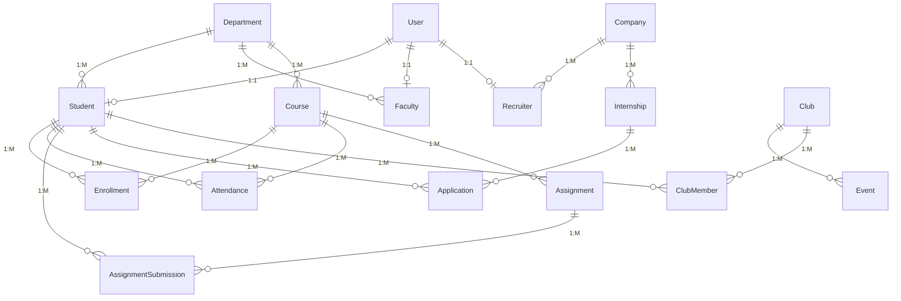

# CampusConnect - DBMS End Semester Evaluation Report

**Project Title:** CampusConnect: Smart University Management & Student Ecosystem Platform
**Domain:** Enterprise Resource Planning (ERP) / University Management System
**Database Engine:** PostgreSQL (v14+)
**Framework:** Node.js, Express, React, Vite

---

## 1. Project Objective

The objective of this project is to build a robust, scalable, and highly normalized database system that drives a modern University Ecosystem platform. While most university systems focus solely on academia, **CampusConnect** integrates Academic Management, Student Ecosystems (Clubs, Events), and Placement tracking into a single, cohesive database schema.

The primary goal of this submission is to demonstrate advanced Database Management System (DBMS) concepts, including Entity-Relationship modeling, normalization, views, triggers, stored procedures, and complex analytical SQL querying.

## 2. Database Design & Normalization

The database consists of **23 normalized tables** (up to 3NF) designed to minimize redundancy and prevent update anomalies.

### Entities Overview:
*   **Users:** `User`, `Student`, `Faculty`, `Department`
*   **Academics:** `Course`, `Enrollment`, `Attendance`, `Assignment`, `Submission`
*   **Ecosystem:** `Event`, `EventRegistration`, `Club`, `ClubMembership`, `Announcement`, `Feedback`
*   **Placements:** `Company`, `Internship`, `Application`, `ApplicationStatusHistory`
*   **System/Audit:** `Notification`, `ActivityLog`

### ER Diagram

### Schema Design (Key Tables)
1. **User**: `id` (PK, UUID), `email` (String, Unique), `passwordHash` (String), `role` (Enum), `createdAt` (DateTime).
2. **Student**: `id` (PK, UUID), `userId` (FK, UUID), `rollNo` (String, Unique), `departmentId` (FK, UUID), `cgpa` (Float).
3. **Course**: `id` (PK, UUID), `code` (String, Unique), `title` (String), `credits` (Int), `departmentId` (FK, UUID).
4. **Enrollment**: `id` (PK, UUID), `studentId` (FK, UUID), `courseId` (FK, UUID), `semester` (String), `grade` (String). Constraints: Unique(`studentId`, `courseId`, `semester`).
5. **Internship**: `id` (PK, UUID), `companyId` (FK, UUID), `title` (String), `stipend` (Float), `deadline` (DateTime).

### Normalization Highlights:
*   **1NF:** All attributes are atomic. No repeating groups.
*   **2NF:** Achieved via strict use of UUID primary keys. No partial dependencies.
*   **3NF:** No transitive dependencies. E.g., `Student` details (Roll No, CGPA) are separated from the base `User` entity (Email, Name).

### Architectural Trade-Offs (Referential Integrity):
*   **Cascade vs. Soft Deletes:** The schema utilizes `ON DELETE CASCADE` for most relationships (e.g., deleting a User cascades to their Student profile and Enrollments) to prevent orphaned records and demonstrate strict foreign key referential integrity. While a production SaaS might opt for "Soft Deletes" (`isDeleted = true`) for audit purposes, Cascade constraints were explicitly chosen here to keep the database footprint clean during aggressive evaluation testing.

## 3. Implementation of Advanced DBMS Concepts

### 3.1 Triggers (Active Database)
Triggers were extensively used to maintain real-time data integrity:
1.  **Attendance Aggregation (`trg_attendance_change`)**: Automatically recalculates a student's `attendanceRate` in the `Enrollment` table upon insert/update of an `Attendance` record.
2.  **Placement Audit (`trg_application_status_history`)**: Inserts a log into `ApplicationStatusHistory` whenever an internship application changes status.
3.  **Automated Notifications (`trg_placement_notification`)**: Generates system alerts for students upon placement selection/rejection.
4.  **Security Audit Log (`trg_audit_user_activity`)**: Monitors DML statements on core tables and records JSON payloads for security tracking.

### 3.2 Stored Procedures (Transaction Logic)
Business logic is pushed down to the database layer to ensure ACID compliance:
1.  **`EnrollStudent`**: Validates existing enrollments before inserting.
2.  **`ApplyForInternship`**: Checks if the student meets the minimum CGPA threshold and application deadline before allowing insertion into the `Application` table.
3.  **`RegisterForEvent`**: Implements a capacity lock, verifying `current_registrations < max_capacity` to prevent overbooking.
4.  **`SubmitAssignment`**: Date-checks the submission against the assignment deadline to automatically set the `isLate` boolean flag.

### 3.3 Views (Virtual Tables)
To optimize dashboard load times, analytical aggregations were precomputed using Views:
1.  **`vw_student_performance`**: Joins `Student`, `Enrollment`, `Submission`, and `Application` to create a 360-degree academic profile.
2.  **`vw_department_statistics`**: Aggregates faculty/student counts and average CGPAs.
3.  **`vw_course_enrollment_stats`**: Tracks course popularity and average attendance.
4.  **`vw_placement_success_rate`**: Calculates recruitment conversion funnels.

## 4. Complex Analytical Queries

A suite of 15 analytical SQL queries was developed to showcase advanced querying capabilities. These include:
*   **Window Functions:** `RANK() OVER (PARTITION BY department_id ORDER BY cgpa DESC)` to find department toppers.
*   **CTEs (Common Table Expressions):** To segment "At-Risk Students" based on recursive or step-by-step filtering of attendance and grades.
*   **Multi-Joins & Aggregations:** Joining up to 5 tables (`Student`, `Application`, `Internship`, `Company`, `Department`) to generate Placement Drive Reports.
*   **Correlated Subqueries:** To find students who have applied to every top-tier company.

## 5. Software Engineering Practices

*   **Role-Based Access Control (RBAC):** UI routing and API endpoints are strictly protected by JWT tokens verifying Admin, Faculty, Student, or Recruiter roles.
*   **Security:** Database passwords (if used remotely) and JWT secrets are injected via `.env`.
*   **UI/UX:** Built a responsive, premium "Glassmorphic" interface using Tailwind CSS, featuring dark mode, live toast notifications, and interactive charts (Recharts).
*   **API Design:** RESTful architecture wrapping the underlying SQL complexities.

## 6. Conclusion

CampusConnect successfully bridges the gap between theoretical database design and a production-ready SaaS product. It proves that complex database mechanics (Triggers, Procedures, Views) can seamlessly power a modern, high-performance web application ecosystem.
