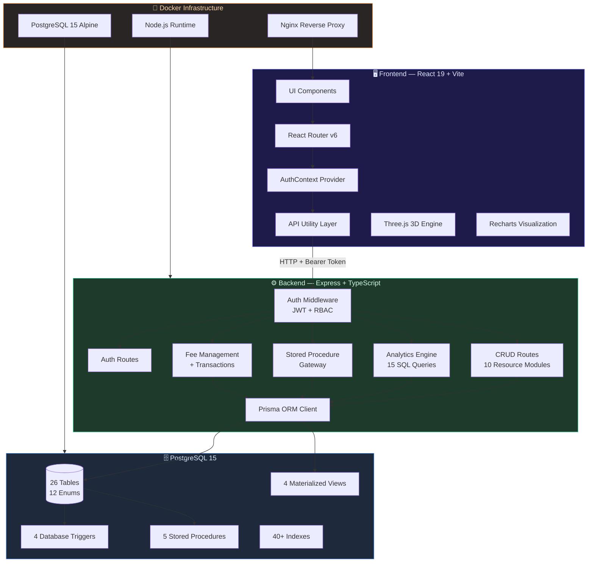
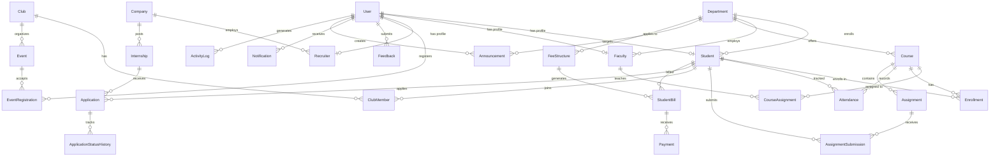
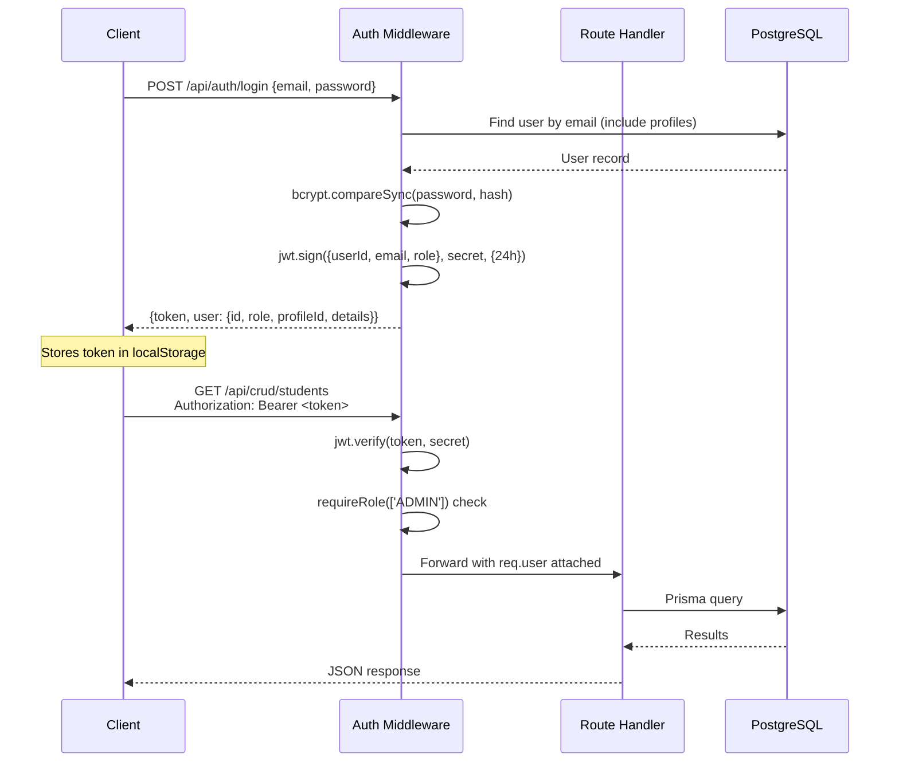

<div align="center">

# 🎓 CampusConnect

### Smart University Management System

[](https://www.typescriptlang.org/)
[](https://react.dev/)
[](https://nodejs.org/)
[](https://www.postgresql.org/)
[](https://www.prisma.io/)
[](https://www.docker.com/)
[](https://threejs.org/)
[](https://tailwindcss.com/)

**A production-grade, full-stack university management platform with role-based dashboards, advanced SQL analytics, database-layer business logic, 3D immersive UI, and containerized deployment.**

[Features](#-features) · [Architecture](#-system-architecture) · [Tech Stack](#-technology-stack) · [Database](#-database-design) · [API](#-api-architecture) · [Setup](#-getting-started) · [Analytics](#-sql-analytics-engine)

---

</div>

## 🧩 What is CampusConnect?

CampusConnect is an enterprise-grade university management system that unifies **academics**, **placements**, **events**, **clubs**, **financials**, and **analytics** into a single platform. It replaces fragmented campus tools with an intelligent, role-aware system designed for four distinct user personas.

> Built with a **26-table normalized PostgreSQL schema**, **4 database triggers**, **5 stored procedures**, **4 materialized views**, **15 analytical SQL queries**, and a **React 19 frontend powered by Three.js 3D graphics** — CampusConnect demonstrates production-level full-stack engineering from database design to pixel-perfect UI.

---

## ✨ Features

<table>
<tr>
<td width="50%">

### 👨‍🎓 Student Portal
- **Personalized Dashboard** with CGPA, attendance, and course metrics
- **Course Enrollment** via database stored procedures with duplicate detection
- **Assignment Tracking** with submission status and due date monitoring
- **Club Discovery** and membership management
- **Event Registration** with capacity-aware booking
- **Internship Applications** with CGPA eligibility enforcement
- **Fee Management** with bill tracking and payment history
- **Feedback Submission** across academic, infrastructure, and service categories

</td>
<td width="50%">

### 👩‍🏫 Faculty Portal
- **Course Analytics Dashboard** with enrollment and attendance metrics
- **Assignment Management** with creation, grading, and submission review
- **Student Performance** monitoring via database views
- **Real-time Submission Feed** with student details and course context
- **Course Assignment** tracking across semesters and academic years

</td>
</tr>
<tr>
<td width="50%">

### 🏢 Recruiter Portal
- **Placement Dashboard** with application funnel analytics
- **Internship Posting** management with deadline tracking
- **Applicant Review** with student profiles, CGPA, and department info
- **Selection Pipeline** visualization (Applied → Screening → Interview → Offered)
- **Company Statistics** via materialized placement views

</td>
<td width="50%">

### 🛡️ Admin Console
- **University-wide Analytics** with student, faculty, and recruiter counts
- **Department-level Placement Metrics** with hire rates
- **Student & Faculty CRUD** management with department assignment
- **Fee Structure Management** with bulk invoice generation via transactions
- **Announcement Broadcasting** with department-targeted delivery
- **Activity Audit Logs** with IP tracking and action history
- **Interactive SQL Query Runner** with 15 pre-built analytical queries

</td>
</tr>
</table>

### 🎯 System-Wide Capabilities

| Capability | Implementation |
|:---|:---|
| **JWT Authentication** | bcrypt password hashing + Bearer token auth with 24h expiry |
| **Role-Based Access Control** | Middleware-enforced guards for Admin, Student, Faculty, Recruiter |
| **Database Triggers** | Auto-update attendance rates, log application history, generate notifications |
| **Stored Procedures** | EnrollStudent, ApplyForInternship, RegisterForEvent, SubmitAssignment, GenerateStudentReport |
| **Materialized Views** | StudentPerformanceView, CourseAnalyticsView, PlacementStatisticsView, ClubParticipationView |
| **3D Parallax Background** | WebGL-powered starfield using Three.js, React Three Fiber, and post-processing effects |
| **Page Transitions** | Framer Motion animated route transitions with blur, scale, and opacity effects |
| **Dark Mode** | System-aware with glassmorphism UI and custom cursor |
| **Data Visualization** | Recharts-powered charts (Bar, Pie, Area, RadialBar) across all dashboards |
| **Containerized Deployment** | Docker Compose with PostgreSQL, Express backend, and Nginx-served frontend |

---

## 🏗 System Architecture



---

## 🛠 Technology Stack

### Frontend

| Technology | Purpose | Version |
|:---|:---|:---|
| **React** | Component framework | 19.2.7 |
| **TypeScript** | Type-safe development | 6.0.2 |
| **Vite** | Build tool & dev server | 8.1.1 |
| **Tailwind CSS** | Utility-first styling with glassmorphism design system | 3.4.1 |
| **Framer Motion** | Page transitions & micro-animations | 12.42.2 |
| **React Three Fiber** | Declarative Three.js integration | 9.6.1 |
| **Three.js** | WebGL 3D starfield background | 0.185.1 |
| **@react-three/drei** | Three.js helpers (Points, Float, Bloom) | 10.7.7 |
| **@react-three/postprocessing** | GPU post-processing effects | 3.0.4 |
| **Recharts** | Data visualization (Bar, Pie, Area, RadialBar charts) | 2.12.3 |
| **React Router** | Client-side routing with route guards | 6.22.3 |
| **Lucide React** | Icon library | 0.363.0 |
| **clsx + tailwind-merge** | Conditional className composition | Latest |
| **OxLint** | Fast TypeScript/JavaScript linter | 1.71.0 |

### Backend

| Technology | Purpose | Version |
|:---|:---|:---|
| **Node.js** | Runtime environment | 20 (Alpine) |
| **Express** | REST API framework | 4.19.2 |
| **TypeScript** | Type-safe server code | 5.4.5 |
| **Prisma** | Type-safe ORM with migrations | 5.12.1 |
| **JSON Web Tokens** | Stateless authentication | 9.0.2 |
| **bcryptjs** | Password hashing (salt rounds) | 2.4.3 |
| **Zod** | Runtime schema validation | 3.22.4 |
| **tsx** | TypeScript execution & watch mode | 4.7.2 |
| **dotenv** | Environment variable management | 16.4.5 |

### Database & Infrastructure

| Technology | Purpose | Version |
|:---|:---|:---|
| **PostgreSQL** | Relational database with triggers, views, and stored procedures | 15 Alpine |
| **Docker Compose** | Multi-container orchestration | 3.8 |
| **Nginx** | Static asset serving & SPA routing | Alpine |
| **Vercel** | Frontend deployment (configured) | — |

---

## 🗃 Database Design

### Schema Overview

**26 Tables · 12 Enums · 40+ Indexes · 4 Triggers · 5 Stored Procedures · 4 Views**



### Database-Layer Business Logic

#### Triggers

| Trigger | Table | Action |
|:---|:---|:---|
| `trg_attendance_change` | Attendance | Auto-recalculates `attendanceRate` in Enrollment on INSERT/UPDATE/DELETE |
| `trg_application_status_history` | Application | Logs every status change to ApplicationStatusHistory |
| `trg_placement_notification` | Application | Generates notification to student on application status update |
| `trg_audit_user` / `trg_audit_enrollment` / `trg_audit_application` | User, Enrollment, Application | Writes audit trail to ActivityLog |

#### Stored Procedures

| Function | Purpose | Validation |
|:---|:---|:---|
| `EnrollStudent()` | Creates course enrollment | Duplicate enrollment detection |
| `ApplyForInternship()` | Submits internship application | CGPA ≥ 6.0 check, deadline validation, duplicate prevention |
| `RegisterForEvent()` | Registers user for event | Capacity check, duplicate prevention |
| `SubmitAssignment()` | Handles assignment submission | Auto-detects late submissions, supports resubmission |
| `GenerateStudentReport()` | Returns comprehensive JSON report | Aggregates profile, academics, clubs, and placement data |

#### Materialized Views

| View | Purpose |
|:---|:---|
| `StudentPerformanceView` | Aggregated student metrics: CGPA, courses, attendance, assignment scores |
| `CourseAnalyticsView` | Course-level stats: enrollment count, average attendance, assignment averages |
| `PlacementStatisticsView` | Company metrics: internships posted, applications received, selection rate, avg stipend |
| `ClubParticipationView` | Club activity: member count, coordinator count, events organized |

---

## 🔌 API Architecture

### Route Structure

```
/api
├── /auth
│   ├── POST   /login              → JWT authentication
│   └── GET    /me                  → Session validation
│
├── /crud (🔒 Authenticated)
│   ├── /students                   → GET / POST / PUT / DELETE
│   ├── /faculty                    → GET / POST / PUT / DELETE
│   ├── /courses                    → GET / POST / PUT / DELETE
│   ├── /assignments                → GET / POST / PUT / DELETE
│   ├── /events                     → GET / POST / PUT / DELETE
│   ├── /clubs                      → GET / POST / PUT / DELETE
│   ├── /internships                → GET / POST / PUT / DELETE
│   ├── /applications               → GET / POST / PUT / DELETE
│   ├── /announcements              → GET / POST / PUT / DELETE
│   └── /feedback                   → GET / POST / PUT / DELETE
│
├── /analytics (🔒 Authenticated)
│   ├── GET    /student-dashboard/:studentId
│   ├── GET    /faculty-dashboard/:facultyId
│   ├── GET    /recruiter-dashboard/:companyId
│   ├── GET    /admin-dashboard
│   ├── GET    /queries             → List 15 analytical SQL definitions
│   └── POST   /queries/:id/run    → Execute analytical query by ID
│
├── /procedures (🔒 Authenticated)
│   ├── POST   /enroll-student
│   ├── POST   /apply-internship
│   ├── POST   /register-event
│   ├── POST   /submit-assignment
│   └── GET    /student-report/:studentId
│
├── /fees (🔒 Authenticated + RBAC)
│   ├── GET    /structures          → Admin only
│   ├── POST   /structures          → Admin only
│   ├── GET    /student/:studentId  → Student/Admin
│   └── POST   /generate-invoices   → Admin only (batch transaction)
│
├── GET  /departments               → Quick lookup
├── GET  /companies                  → Quick lookup
├── GET  /notifications (🔒)        → User-specific, latest 20
├── PUT  /notifications/:id/read (🔒)
├── GET  /activity-logs (🔒)        → Admin audit trail
└── GET  /health                     → Health check
```

### Authentication Flow



---

## 📁 Project Structure

```
CampusConnect/
├── frontend/                          # React 19 SPA
│   ├── src/
│   │   ├── components/
│   │   │   ├── ui/                    # Reusable component library
│   │   │   │   ├── Badge.tsx          # Status badges with variants
│   │   │   │   ├── Button.tsx         # Polymorphic button component
│   │   │   │   ├── Card.tsx           # Glass-morphism card containers
│   │   │   │   ├── CustomCursor.tsx   # Custom animated cursor
│   │   │   │   ├── Input.tsx          # Form input component
│   │   │   │   ├── Skeleton.tsx       # Loading skeleton placeholders
│   │   │   │   └── Table.tsx          # Data table with styled cells
│   │   │   ├── financials/
│   │   │   │   └── StudentFinancials.tsx  # Fee & payment dashboard
│   │   │   ├── Navbar.tsx             # Top navigation with notifications
│   │   │   ├── Sidebar.tsx            # Role-aware sidebar navigation
│   │   │   ├── ParallaxBackground.tsx # Three.js 3D starfield + Bloom
│   │   │   └── ThemeToggle.tsx        # Dark/light mode toggle
│   │   ├── contexts/
│   │   │   └── AuthContext.tsx         # JWT auth state management
│   │   ├── pages/
│   │   │   ├── DashboardPage.tsx       # 4 role-specific dashboards (768 lines)
│   │   │   ├── LoginPage.tsx           # Animated login with 3D background
│   │   │   ├── ManageStudents.tsx      # Admin CRUD for students
│   │   │   ├── ManageFaculty.tsx       # Admin CRUD for faculty
│   │   │   ├── CoursesPage.tsx         # Course management
│   │   │   ├── AssignmentsPage.tsx     # Assignment workflow
│   │   │   ├── EventsPage.tsx          # Event discovery & registration
│   │   │   ├── ClubsPage.tsx           # Club management & membership
│   │   │   ├── PlacementsPage.tsx      # Internship pipeline
│   │   │   ├── AnnouncementsPage.tsx   # Announcement broadcasting
│   │   │   ├── FeedbackPage.tsx        # Feedback submission & review
│   │   │   ├── FeeManagementPage.tsx   # Fee structure & invoicing
│   │   │   └── SqlQueryPage.tsx        # Interactive SQL query runner
│   │   ├── utils/
│   │   │   └── api.ts                  # Centralized fetch wrapper with auth
│   │   ├── lib/
│   │   │   └── utils.ts                # clsx + tailwind-merge utility
│   │   ├── App.tsx                     # Route definitions + RBAC guards
│   │   ├── main.tsx                    # App entry point
│   │   └── index.css                   # Global styles + glassmorphism tokens
│   ├── tailwind.config.js              # Custom design system tokens
│   ├── vite.config.ts                  # Vite build configuration
│   ├── Dockerfile                      # Multi-stage build → Nginx
│   └── vercel.json                     # SPA rewrite rules for Vercel
│
├── backend/                            # Express REST API
│   ├── src/
│   │   ├── routes/
│   │   │   ├── auth.ts                 # Login + session endpoints
│   │   │   ├── crud.ts                 # CRUD router aggregator
│   │   │   ├── crud/                   # 10 resource-specific CRUD modules
│   │   │   │   ├── students.ts
│   │   │   │   ├── faculty.ts
│   │   │   │   ├── courses.ts
│   │   │   │   ├── assignments.ts
│   │   │   │   ├── events.ts
│   │   │   │   ├── clubs.ts
│   │   │   │   ├── internships.ts
│   │   │   │   ├── applications.ts
│   │   │   │   ├── announcements.ts
│   │   │   │   └── feedback.ts
│   │   │   ├── analytics.ts            # 15 analytical queries + dashboard APIs
│   │   │   ├── procedures.ts           # Stored procedure gateway
│   │   │   └── fees.ts                 # Fee management + batch transactions
│   │   ├── middleware/
│   │   │   └── auth.ts                 # JWT verification + role guard
│   │   ├── index.ts                    # Express server entry point
│   │   └── types.ts                    # Shared type definitions
│   ├── prisma/
│   │   ├── schema.prisma               # 26-model schema definition
│   │   ├── seed.ts                     # Comprehensive seeder (21k chars)
│   │   └── migrations/                 # Prisma migration history
│   ├── Dockerfile                      # Node.js + Prisma → auto-migrate on start
│   └── package.json
│
├── database/                           # Raw SQL definitions
│   ├── schema.sql                      # Full DDL (676 lines)
│   ├── triggers.sql                    # 4 triggers + 5 stored procedures
│   ├── views.sql                       # 4 materialized views
│   ├── queries.sql                     # 5 mandatory analytical queries
│   └── seed.sql                        # Reference seed data
│
├── analytics/                          # Data analysis artifacts
│   ├── raw_data.csv
│   ├── cleaned_data.csv
│   └── CampusConnect_Dashboard.xlsx
│
├── dva_lab/                            # Data Visualization & Analytics
│   ├── generate_raw_data.py            # Synthetic data generator
│   ├── clean_data.py                   # Data cleaning pipeline
│   ├── generate_excel.py               # Dashboard workbook generator
│   └── CampusConnect_Dashboard.xlsx    # Tableau-ready analytics workbook
│
├── scripts/
│   └── verify.sh                       # 15-query DBMS verification script
│
├── docker-compose.yml                  # 3-service orchestration
└── docs/                               # Generated query output artifacts
```

---

## 📊 SQL Analytics Engine

CampusConnect includes a **built-in interactive SQL query runner** with 15 pre-built analytical queries accessible from the frontend UI. Each query is categorized by SQL technique:

| # | Query | SQL Technique |
|:---:|:---|:---|
| 1 | Student profile details with Department | `INNER JOIN` |
| 2 | Course schedule assignments to Faculty | `LEFT JOIN` |
| 3 | Recruiter and Company relations | `RIGHT JOIN` |
| 4 | High Attendance Class Roster | `GROUP BY + HAVING` |
| 5 | Academic Valedictorian Roster | `SCALAR SUBQUERY` |
| 6 | Departmental High Performers | `CORRELATED SUBQUERY` |
| 7 | Popular Club Finder | `NESTED SUBQUERY IN HAVING` |
| 8 | Intra-Departmental Ranks | `WINDOW FUNCTION (RANK)` |
| 9 | Assignment Time Gaps | `WINDOW FUNCTION (LAG)` |
| 10 | Event Registration Pacing | `WINDOW FUNCTION (COUNT OVER)` |
| 11 | Student Performance Dashboard Summary | `VIEW QUERY` |
| 12 | Course Analytics Class Average Metrics | `VIEW QUERY` |
| 13 | Recruiter and Company Placement Statistics | `VIEW QUERY` |
| 14 | Departmental Resource Count | `SCALAR SUBQUERIES IN SELECT` |
| 15 | Recruitment Stages Funnel | `CONDITIONAL AGGREGATION / PIVOT` |

> Each query exposes its raw SQL, purpose description, and technical explanation through the API, enabling the frontend to display educational context alongside live results.

---

## 🚀 Getting Started

### Prerequisites

| Requirement | Version |
|:---|:---|
| Node.js | ≥ 20 |
| PostgreSQL | ≥ 15 |
| npm | ≥ 9 |
| Docker & Docker Compose | Latest (optional) |

### Option 1: Docker Compose (Recommended)

```bash
# Clone the repository
git clone https://github.com/singhankit001/CampusConnect.git
cd CampusConnect

# Start all services
docker compose up --build -d

# Access the application
# Frontend → http://localhost
# Backend  → http://localhost:5050
# Database → localhost:5432
```

### Option 2: Manual Setup

#### 1. Database Setup

```bash
# Create PostgreSQL database
createdb campusconnect_db

# Apply schema, views, triggers, and seed data
psql -d campusconnect_db -f database/schema.sql
psql -d campusconnect_db -f database/views.sql
psql -d campusconnect_db -f database/triggers.sql
psql -d campusconnect_db -f database/seed.sql
```

#### 2. Backend Setup

```bash
cd backend

# Install dependencies
npm install

# Configure environment
cp .env.example .env
# Edit .env with your database credentials

# Generate Prisma client and run migrations
npx prisma generate
npx prisma migrate dev

# Seed database with comprehensive test data
npm run db:seed

# Start development server
npm run dev
```

#### 3. Frontend Setup

```bash
cd frontend

# Install dependencies
npm install

# Start development server
npm run dev
```

### Environment Variables

```env
# backend/.env
DATABASE_URL="postgresql://<user>:<password>@localhost:5432/campusconnect_db?schema=public"
JWT_SECRET="your-secure-jwt-secret-key"
PORT=5050
```

---

## 🔐 Security Implementation

| Layer | Implementation |
|:---|:---|
| **Password Storage** | bcryptjs with salt rounds — never stores plaintext |
| **Authentication** | JSON Web Tokens (JWT) with 24-hour expiry |
| **Authorization** | Role-based middleware (`requireRole`) enforces ADMIN, STUDENT, FACULTY, RECRUITER permissions |
| **Route Protection** | Frontend route guards + backend middleware double-enforcement |
| **Input Validation** | Zod schema validation on request bodies |
| **SQL Injection Prevention** | Prisma parameterized queries + `$queryRawUnsafe` with positional parameters |
| **CORS Configuration** | Configurable origin policy |
| **Activity Auditing** | Database triggers auto-log sensitive actions with IP addresses |
| **Session Management** | Token stored in localStorage with auto-restore on page refresh |
| **Error Handling** | Global error handler prevents stack trace leaks in production |

---

## ⚡ Performance & Engineering Quality

| Optimization | Detail |
|:---|:---|
| **40+ Database Indexes** | Composite and single-column indexes on all foreign keys and frequently queried fields |
| **Unique Constraints** | Compound unique indexes prevent data duplication (e.g., one enrollment per student per course per semester) |
| **Cascade Deletes** | Referential integrity maintained with `ON DELETE CASCADE` across related entities |
| **Database-Level Computation** | Attendance rates calculated by triggers, not application code |
| **Batch Transactions** | Fee invoice generation uses Prisma `$transaction` for atomic bulk operations |
| **Lazy Loading** | Role-specific dashboard data fetched only for the authenticated user's role |
| **Animated Page Transitions** | Framer Motion `AnimatePresence` with blur/scale/opacity transitions |
| **Multi-stage Docker Builds** | Frontend built in Node, served via Nginx — minimal production image |
| **BigInt Serialization** | Custom `toJSON` handler for PostgreSQL BigInt compatibility |
| **Request Logging** | Timestamped HTTP request logger middleware |

---

## 🎨 UI / UX Design System

CampusConnect implements a **custom glassmorphism design system** built on Tailwind CSS with:

- **Brand Palette**: Indigo-based (`#6366F1`) inspired by Stripe/Linear aesthetics
- **Glass Surfaces**: `rgba(15, 23, 42, 0.65)` with `backdrop-blur` for depth
- **Typography**: Inter (body) + Outfit (display) from Google Fonts
- **Custom Animations**: `fadeIn`, `slideUp`, `pulseGlow`, `shimmer` keyframes
- **3D Background**: Three.js starfield with Bloom post-processing, floating icosahedrons, and torus geometries
- **Custom Cursor**: Animated cursor component for premium feel
- **Responsive Layout**: Collapsible sidebar with mobile-first breakpoints
- **Dark Mode**: Class-based toggle with `darkMode: 'class'`

---

## 🗺 Roadmap

- [ ] **WebSocket Integration** — Real-time notifications and live dashboard updates
- [ ] **File Upload Service** — Cloud storage for resumes and assignment submissions
- [ ] **Email Notifications** — Transactional emails for application status changes
- [ ] **Advanced Analytics** — Predictive models for student performance and placement trends
- [ ] **Mobile App** — React Native cross-platform companion app
- [ ] **CI/CD Pipeline** — GitHub Actions with automated testing and deployment
- [ ] **Rate Limiting** — Express rate limiter for API abuse prevention
- [ ] **Swagger/OpenAPI** — Auto-generated API documentation

---

## 🤝 Contributing

Contributions are welcome. To get started:

1. **Fork** the repository
2. **Create** a feature branch (`git checkout -b feature/your-feature`)
3. **Commit** with conventional commits (`git commit -m "feat: add new feature"`)
4. **Push** to your branch (`git push origin feature/your-feature`)
5. **Open** a Pull Request with a clear description

### Development Guidelines

- Follow TypeScript strict mode conventions
- Maintain Prisma schema as the single source of truth for database changes
- Write route handlers with proper error handling and status codes
- Use the existing UI component library (`components/ui/`) for consistency

---

## 📄 License

This project is open-source and available under the [MIT License](LICENSE).

---

<div align="center">

### Built by [Ankit Singh](https://github.com/singhankit001)

[](https://github.com/singhankit001)

<sub>Engineered with ❤️ and a lot of ☕ — Full-stack TypeScript · PostgreSQL · React 19 · Three.js</sub>

</div>
